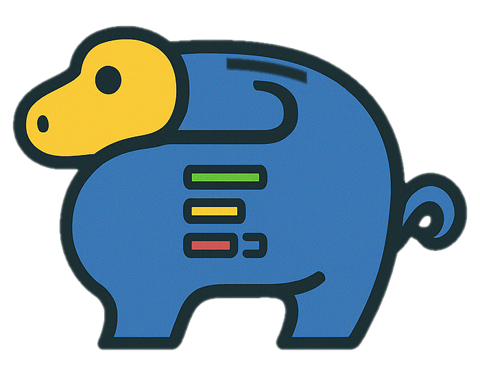

# PyGGy - Python (Monthly) Expense Tracker

A Django-based expense tracking application designed to manage different types of
expenses with monthly processing workflows.

## Features

### Core Functionality

- **Four Expense Types**:
  - **Endless Recurring**: Monthly expenses without end date (utilities, subscriptions)
  - **Split Payments**: Fixed installments (loans, payment plans)
  - **One-time Payments**: Single payment expenses
  - **Recurring with End Date**: Monthly expense expenses until time comes
- **Monthly Processing**: Sequential month creation with automatic expense generation
- **Payment Tracking**: Record actual payment dates and methods
- **Multiple Budgets**: Let's you track multiple money pipelines at once
- **Business Rules Enforcement**: Start date validation, automatic expense completion

## Documentation

- **[Installation Guide](docs/installation.md)**: How to set up PyGGy
- **[User Documentation](docs/README.md)**: User documentation for getting started, managing expenses, and understanding workflows
- **[Changelog](CHANGES.md)**: Application development history and updates

## Copyright and License

- Written and copyrighted &copy;2025 by [Marcin Orlowski](https://marcinOrlowski.com/)
- PyGGy is licensed under the [MIT license](http://opensource.org/licenses/MIT)
