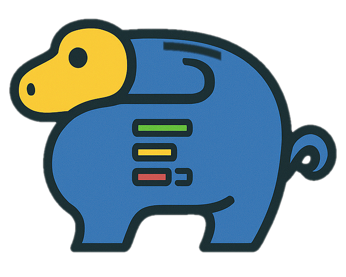

# PyGGy Usage Documentation

Welcome to PyGGy, a Django-based monthly expense tracker designed to help you manage your finances
with precision and clarity. This documentation will guide you through understanding and using all
aspects of the application.

## Table of Contents

### User Documentation

- [Getting Started](getting_started) - Quick setup and first steps
- [Understanding Expense Types](expense_types) - The four types of expenses and when to use them
- [Budget Management](budgets) - Creating and managing budgets effectively
- [Monthly Workflow](monthly_workflow) - How to work with monthly processing and payment tracking
- [Managing Payees & Payment Methods](payees_and_payments) - Setting up vendors and payment options

### Developer Documentation

- [Template Tags](template_tags) - Custom Django template tags and filters reference
- [Docker Setup](docker) - Running PyGGy with Docker
- [Error Handling](error_handling) - Understanding application errors

## What is PyGGy?

PyGGy is a comprehensive expense tracking system that helps you manage recurring bills, one-time
payments, and installment plans. Unlike simple expense trackers, PyGGy understands the complexities
of real-world financial management:

- **Multiple Budget Support**: Track different financial streams separately
- **Intelligent Expense Types**: Four distinct expense types for different payment scenarios
- **Monthly Processing**: Sequential month-by-month workflow that mirrors real-life budgeting
- **Payment Tracking**: Record when and how expenses are actually paid
- **Vendor Management**: Organize who you pay and how you pay them

## Core Concepts

### Budgets

Budgets are containers that organize related expenses. You might have separate budgets for personal
expenses, business costs, or different family members.

### Expenses

Expenses are recurring or one-time financial obligations. They define *what* you need to pay, *when*
it's due, and *how much* it costs.

### Expense Items

Expense items are the actual monthly instances of expenses. When you create a recurring expense,
PyGGy automatically generates expense items for each month.

### Payments

Payments record when expense items are actually paid, including the payment date and method used.

## Quick Start

1. **[Set up your environment](getting_started)** - Get PyGGy running
2. **[Create your first budget](budgets)** - Organize your expenses
3. **[Add some expenses](expense_types)** - Define what you need to pay
4. **[Start tracking payments](monthly_workflow)** - Record when you pay bills

## Getting Help

- **In-App Help**: This documentation is available within PyGGy through the Help menu
- **GitHub Issues**: [Report bugs or request features](https://github.com/MarcinOrlowski/pyggy-expense-tracker/issues)
- **Source Code**: [View the project on GitHub](https://github.com/MarcinOrlowski/pyggy-expense-tracker)
